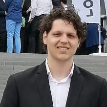

## About Me

Hi! I am a student Bachelor Applied Computer Sciences PXL at PXL University Hasselt. Graduated with an associates degree at PXL in 2023.

## Associates Degree Programming

During my associates degree there was mainly a focus on .NET, specifically C#, .NET MAUI. During my 6 month internship at PrintSimple i learned PHP Content Management Systems like Drupal & Laravel, where i created a Project Tracking Platform in Laravel.

## Studies

Year | School | Degree
-----|-------|--------
2014 | Emmy  | Won Outstanding Lead Actor in a miniseries or a movie
2015 | BAFTA | Nominated for Best Leading Actor for Sherlock
2015 - 2019 | Satellite | Won Best Actor miniseries or television film

## Typography

This is a [link](http://google.com). Something *italics* and something **bold**.

Here is a table

Here is a horizontal rule

---

Here is a blockquote

> Sharing is good, and with digital technology, sharing is easy

## References

* Foo Bar: Head of Department, Placeholder Names, Lorem
* John Doe: Associate Professor, Department of Computer Science, Ipsum
